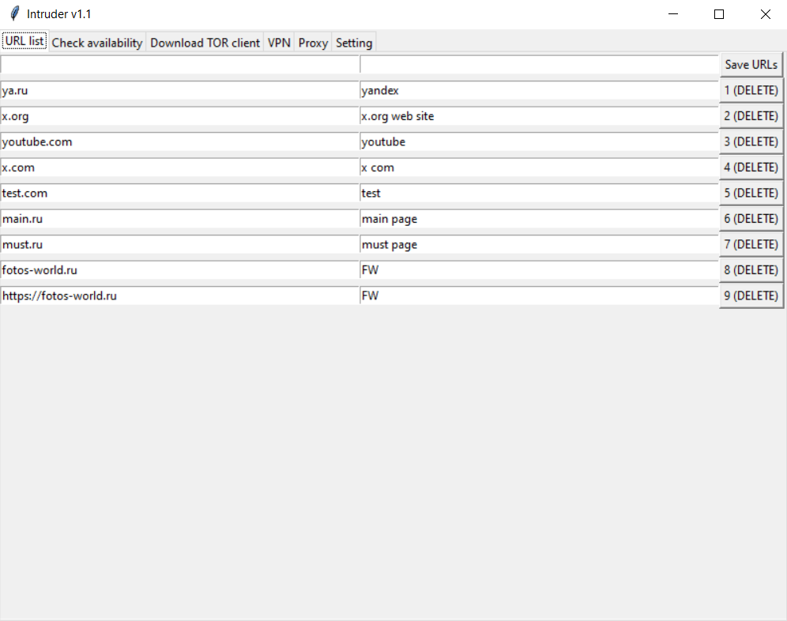
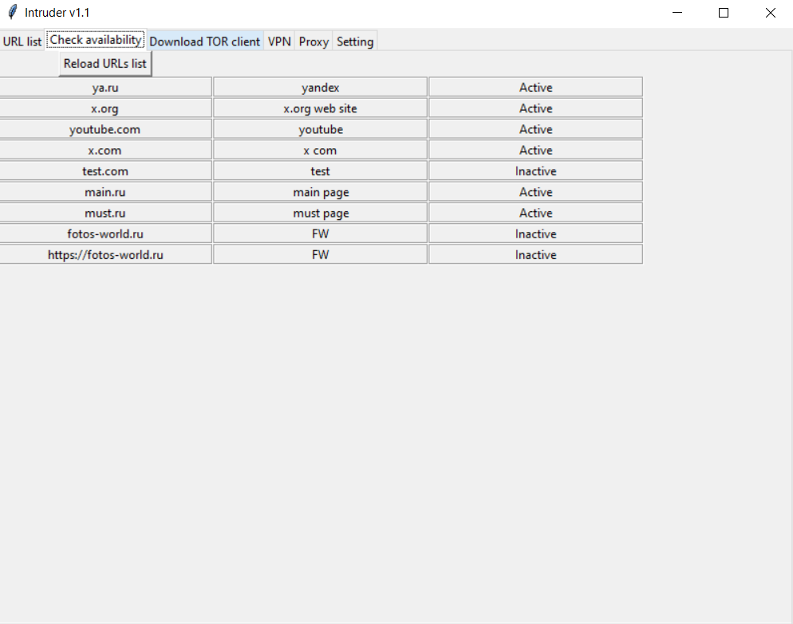
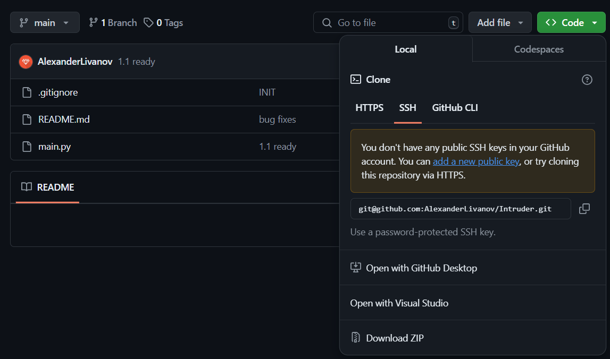
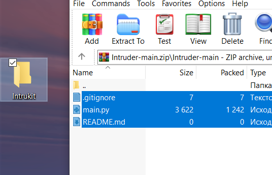
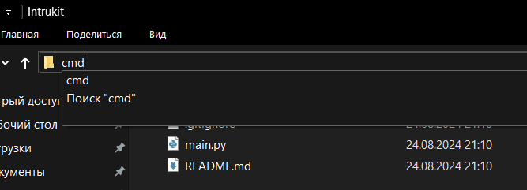

# Inruder Toolkit v1.1

### О проекте

Проект представляет собой приложение с полезными инструментами:
1) Сохранение длинных .onion URL адресов с их описанием
2) Проверка их доступности (поднят ли хост)
3. Зеркало для установки и обновления TOR клиента (скоро)
4. Инструмент для установки и настройки VPN соединений (скоро)
5. Инструмент для настройки Proxy (скоро)

Короче для обхода блокировок.
Новые инструменты будут добавляться.

### Скриншоты программы



### Установка
###### Для Windows юзеров
- скачайте архив с программой (кнопка download zip)
 

- распакуйте архив в удобную для вас папку


- (для дальнейшей работы у вас должен быть установлен интерпретатор Python)

- откройте командную строку в папке с проектом


- в приглашение командной строки введите 
    ```python
    python3 main.py
    ```
После всех этих действий должно открыться окно, для особо тупых будет сделан .exe файл. 

###### Для линуксоидов
Я думаю те кто пользуется линуксом сами знают как это установить

(через git клонируйте репозиторий и `python3 main.py`)

### FAQ you
- "Не запускается, не может что-то найти, что-то не работает"
    Ну значит кривые лапки. Поставьте ещё раз. У меня всё работает

- "Зависает приложение при нажатии кнопки "Reload URL list""
    Это норма, но скоро исправим

- "При нажатии кнопки "Delete" ничего не меняется"
    Не баг, а фича (скоро пофиксим)

- "Как внести изменения в код?"
    Через пулл-реквест на гитхабе...

- "Программа будет платной?"
    Нет, для котанов бесплатно! За FOSS!

(last update 24.08.2024)